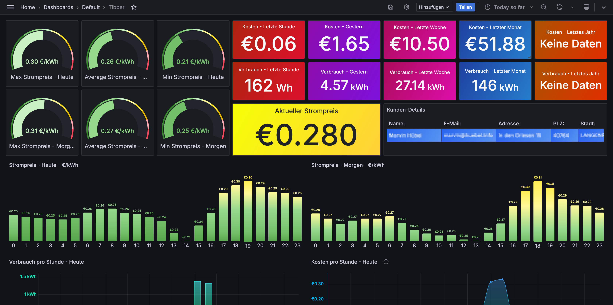
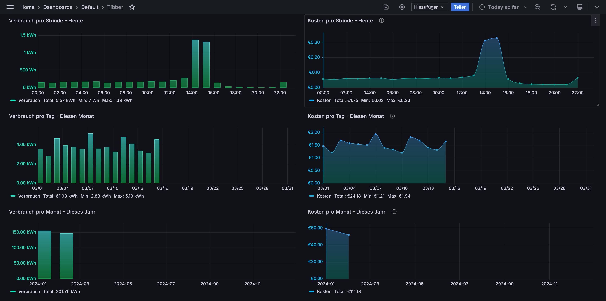
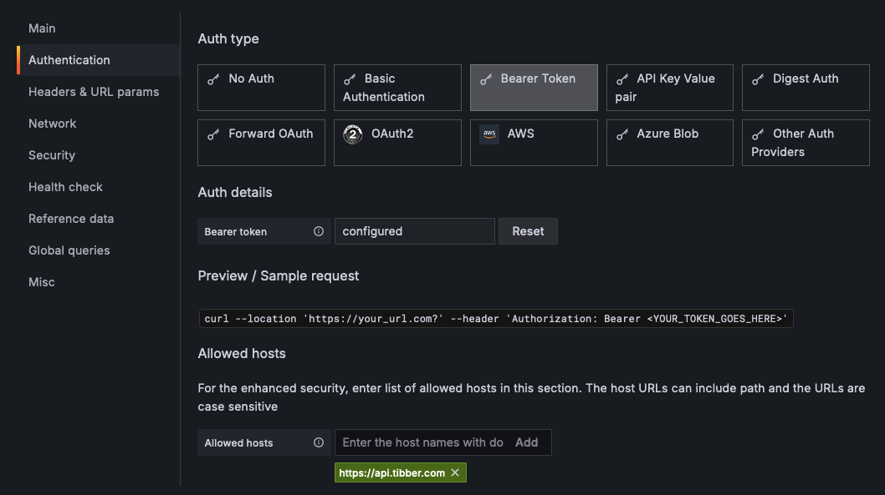

# tibber-grafana
Grafana Dashboard for Tibber

The dashboard has been developed for german-speaking users, so the rest of the description is written in german.

## Screenshots

## Infos

Als Datenquelle wird direkt die Tibber API genutzt.

Als Vorlage wurde das Dashboard von Hawar Koyi genutzt und modifiziert. https://grafana.com/grafana/dashboards/17008-tibber/

## Voraussetzungen

Das Dashboard nutzt das Plugin Infinity.

Eine Installationsanleitung gibt es hier: https://grafana.com/grafana/plugins/yesoreyeram-infinity-datasource/?tab=installation

## Datenquelle einrichten

In der Datenquelle wird als “Auth type” “Bearer Token” ausgewählt. 

Euer Token wird auf der Tiiber Entwicklerseite angezeigt. https://developer.tibber.com/settings/access-token 

Als “Allowed hosts” wird noch “https://api.tibber.com” eingetragen.

## Dashboard importieren

https://grafana.com/grafana/dashboards/20712-tibber/
